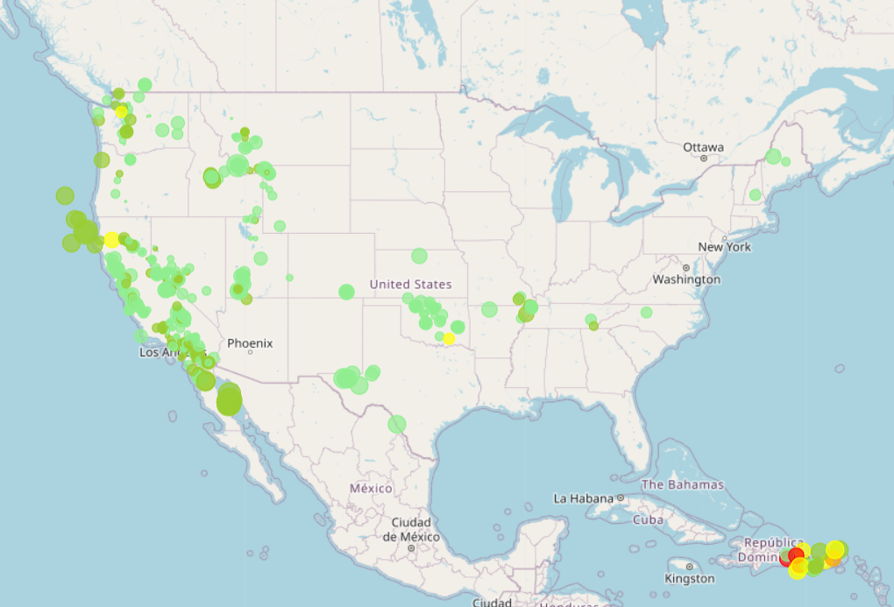

# leaflet-challenge

This exercise helped me get an understanding of the javascript extension Leaflet which creates maps. 

The below is a visualization of earthquake data from the United States Geological Survey  [USGS GeoJSON Feed](http://earthquake.usgs.gov/earthquakes/feed/v1.0/geojson.php).

